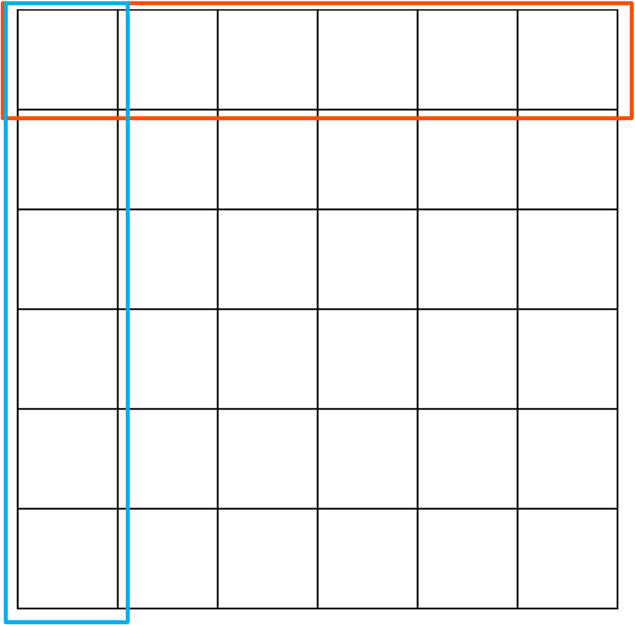

# `block` Customization Point Design

<!-- vscode-markdown-toc -->
* [Motivation](#Motivation)
* [Construction](#Construction)
	* [BCSR Construction](#BCSRConstruction)
	* [BCSR View](#BCSRView)
* [Application](#Application)
	* [SpMV](#SpMV)
		* [Prepare](#Prepare)
		* [SpMV](#SpMV-1)
	* [Parallelism](#Parallelism)
		* [Reductions along blocks of rows](#Reductionsalongblocksofrows)
		* [Reductions along blocks of column](#Reductionsalongblocksofcolumn)

<!-- vscode-markdown-toc-config
	numbering=false
	autoSave=true
	/vscode-markdown-toc-config -->
<!-- /vscode-markdown-toc -->

## <a name='Motivation'></a>Motivation

Existing customization points include `row`, `column` and `diagonal`. Besides these, block view is known as a common view for parallelism. Therefore, `block` view is adopted as a new cp.

## <a name='Construction'></a>Construction
Here we implement BCSR format as a representative blocked sparse format and  each block is a `dense_matrix_view`. 

### <a name='BCSRConstruction'></a>BCSR Construction

It's recommended to use provided `mc::generate_bcsr` function to directly generate random benchmark by providing the following 5 arguments:
+ `m` and `n` describe the shape of matrix;
+ `block_height` and `block_width` describe the shape of block;
+ `nnz` specifies the number of non-zeros in sparse matrix;

```c++
auto [values, rowptr, colind, shape, a_nnz] =
    mc::generate_bcsr(m, n, block_height, block_width, nnz);
```

### <a name='BCSRView'></a>BCSR View

There are two ways to view generated BCSR matrix. First way is to use `bcsr_matrix_view`.

```c++
auto [values, rowptr, colind, shape, a_nnz] =
    mc::generate_bcsr(m, n, block_height, block_width, nnz);

mc::bcsr_matrix_view view(values.begin(), rowptr.begin(), colind.begin(),
                          shape, block_height, block_width, nnz);
```

The following 7 arguments are required to construct a BCSR view.
+ `values` is the array contains the entries of blocks from original matrix;
+ `rowptr` is the array contains the starting point of each row in block's view in `values` array;
+ `colind` is the array contains the column index of each block in block's view;
+ `shape` is the size of the original matrix;
+ `block_height` is the first dimension of block;
+ `block_width` is the second dimension of block;
+ `nnz` is the number of non-zero elements in original matrix.

In fact, `shape` and `nnz` can be deduced by other arguments. Currently, we choose to keep this redundancy.

For example, for matrix $A$ as follow:

$$
A = \left(
\begin{matrix}
0 & 2.42  & 0 & 0 & 0 & 0 \\
59.26 & 0 & 0 & 0 & 0 & 0 \\
0 & 0 & 0 & 0 & 0 & 0 \\
85.34 & 91.42 & 82.82 & 0 & 0 & 0\\
0 & 0 & 0 & 0 & 0 & 0\\
0 & 0 & 0 & 0 & 0 & 0\\
\end{matrix}
\right)
$$

Its `values`, `rowptr` and `colind` arrays are as follows:
```
values: [0, 2.42, 59.26, 0, 0, 0, 85.34, 91.42, 0, 0, 82.82, 0]
rowptr: [0, 1, 3, 3]
colind: [0, 0, 1]
```

Another way is to use `std::mdspan` to construct views for BCSR format. Compared with `bcsr_matrix_view` way, we only pass necessary argument here. Since conversion is user-invisible, it has more user-friendly interface `mc::blocks()`.

```c++
auto [values, rowptr, colind, shape, nnz] =
    mc::generate_bcsr(m, n, block_height, block_width, nnz);

std::experimental::mdspan a(values(), rowptr, colind, block_shape);

for (auto && [{bx, by}, block] : mc::blocks(a)) {
  auto values = std::ranges::views::values(block);
  fmt::print("A {} x {} block at {}, {} containing values {}\n",
                   block_height, block_width, bx, by, values);
}
```

## <a name='Application'></a>Application 

### <a name='SpMV'></a>SpMV

#### <a name='Prepare'></a>Prepare
We provide a function `foreach` to iterate ranges. Its usage is like
```c++
mc::bcsr_matrix_view view(values.begin(), rowptr.begin(), colind.begin(),
                          shape, block_height, block_width, nnz);

foreach(view.blocks(), [&](auto){
  // ...
});
```

The draft function definition refers to the definition of [`std::for_each`](https://github.com/gcc-mirror/gcc/blob/d9375e490072d1aae73a93949aa158fcd2a27018/libstdc%2B%2B-v3/include/bits/stl_algo.h#L3858).
```c++
template<typename _ranges, typename _Function>
_Function
foreach(_ranges __ranges, _Function __f) {
  // concept requirements
  for (auto&& it : __ranges) {
    __f(*it);
  }
  return __f;
}  
```

And I try to support zip-view with `foreach`:

```c++
template<typename _zip_view, typename _Function>
_Function
foreach(_zip_view __ranges, _Function __f) {
  // concept requirements
  for (auto&& it : __ranges) {
    __f(*it);
  }
  return __f;
}
```

#### <a name='SpMV-1'></a>SpMV

The processing flow of SpMV $c=Ab$ is designed as follows:
+ Iterate over each block in a sparse matrix. 
+ Iterate over each element in block and calculate its indices to determine the corresponding indices in $b$ and $c$.

```c++
auto [x, shape] = mc::generate_dense(n, 1);
auto [y, shape] = mc::generate_dense(m, 1);
auto [values, rowptr, colind, shape, nnz] =
  mc::generate_bcsr(m, n, block_height, block_width, nnz);

std::experimental::mdspan b(x.data(), shape[0], shape[1]);
std::experimental::mdspan c(y.data(), shape[0], shape[1]);
mc::bcsr_matrix_view A(values.begin(), rowptr.begin(),
              colind.begin(), shape, block_height, block_width, nnz);

auto blocks = A.blocks();

foreach(blocks, [&](auto blockzip) { 
  auto bx = std::get<0>(blockzip);
  auto by = std::get<1>(blockzip);
  auto b = std::get<2>(blockzip);
  auto x_base = bx * b.shape()[0];
  auto y_base = by * b.shape()[1];
  for (auto i : __ranges::views::iota(I(0), b.shape()[0])) {
    for (auto j : __ranges::views::iota(I(0), b.shape()[1])) {
      auto x_addr = x_base + i;
      auto y_addr = y_base + j;
      C[x_addr] += b[{i, j}] * B[y_addr];
    }
  }
});
```

Annotations
+ I'don't know if there is a better way to unpack the block index and block from `blockzip`. Or is there another way to access the position of block?

In this code, `b.shape()[0]` is the block size along the row dimension, and `b.shape()[1]` is the block size along the column dimension.


### <a name='Parallelism'></a>Parallelism 

#### <a name='Reductionsalongblocksofrows'></a>Reductions along blocks of rows

One way to parallelize SpMV kernel is to perform reductions along the row. Each processor only needs to store the segment of C it needs to compute, like the red box in the following figure.

```c++
/// Initialization
auto [x, shape] = mc::generate_dense(n, 1);
auto [y, shape] = mc::generate_dense(m, 1);
auto [values, rowptr, colind, shape, nnz] =
  mc::generate_bcsr(m, n, block_height, block_width, nnz);

std::experimental::mdspan b(x.data(), shape[0], shape[1]);
std::experimental::mdspan c(y.data(), shape[0], shape[1]);
mc::bcsr_matrix_view A(values.begin(), rowptr.begin(), colind.begin(),
                          shape, block_height, block_width, nnz);

/// Computation
#pragma parallel for
foreach (__ranges::views::zip([A.row_blocks(), c.split(A.row_blocks().size())]), 
[&](auto row_block, auto c_seg){
  auto b_segs = b.split(row_block.size());
  foreach (__ranges::views::zip(row_block, b_segs), [&](auto blockzip, auto b_seg){
    auto block = std::get<2>(blockzip)
    for (auto i : __ranges::views::iota(I(0), block.shape()[0])) {
      for (auto j : __ranges::views::iota(I(0), block.shape()[1])) {
        c_seg[i] += block[i, j] * b_seg[j];
      }
    }
  });
});
```

Annotations
+ I use OpenMp-like grammar to call threads to execute the foreach-loop here;
+ Both foreach-loop is the second scenerio;
+ Here I assume `split` is a cpo used to split dense vector into equal-size portion.



#### <a name='Reductionsalongblocksofcolumn'></a>Reductions along blocks of column

Smilarily, another way to parallelize SpMV kernel is to perform reductions along the column.
```c++
/// Initialization
auto [x, shape] = mc::generate_dense(n, 1);
auto [y, shape] = mc::generate_dense(m, 1);
auto [values, rowptr, colind, shape, nnz] =
  mc::generate_bcsr(m, n, block_height, block_width, nnz);

std::experimental::mdspan b(x.data(), shape[0], shape[1]);
std::experimental::mdspan c(y.data(), shape[0], shape[1]);
mc::bcsr_matrix_view A(values.begin(), rowptr.begin(), colind.begin(),
                          shape, block_height, block_width, nnz);

/// Computation
#pragma parallel for
foreach (__ranges::views::zip([A.column_blocks(), b.split(A.column_blocks().size())]), 
[&](auto row_block, auto b_seg){
  auto c_segs = c.split(row_block.size());
  foreach (__ranges::views::zip(row_block, c_segs), [&](auto blockzip, auto c_seg){
    auto block = std::get<2>(blockzip)
    for (auto i : __ranges::views::iota(I(0), block.shape()[0])) {
      for (auto j : __ranges::views::iota(I(0), block.shape()[1])) {
        c_seg[i] += block[i, j] * b_seg[j];
      }
    }
  });
});
```