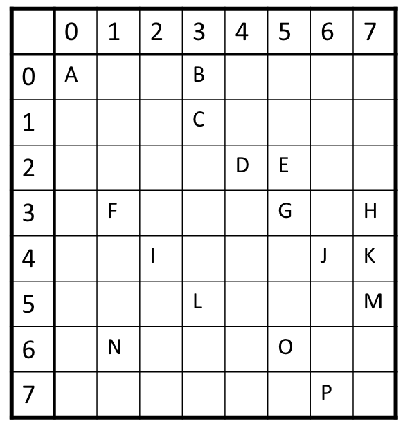

# `block` Customization Point Design

<!-- vscode-markdown-toc -->
* [Motivation](#Motivation)
* [Construction](#Construction)
	* [BCSR Construction](#BCSRConstruction)
	* [BCSR View](#BCSRView)
* [Application](#Application)
	* [SpMV](#SpMV)
		* [Prepare](#Prepare)
		* [SpMV](#SpMV-1)
	* [Parallelism](#Parallelism)
		* [Reductions along blocks of rows](#Reductionsalongblocksofrows)
		* [Reductions along blocks of column](#Reductionsalongblocksofcolumn)

<!-- vscode-markdown-toc-config
	numbering=false
	autoSave=true
	/vscode-markdown-toc-config -->
<!-- /vscode-markdown-toc -->

## <a name='Motivation'></a>Motivation

Existing customization points include `row`, `column` and `diagonal`. Besides these, block view is known as a common view for parallelism. Therefore, `block` view is adopted as a new cp.

## <a name='Construction'></a>Construction
Here we implement BCSR format as a representative blocked sparse format and  each block is a `dense_matrix_view`. 

### <a name='BCSRConstruction'></a>BCSR Construction

It's recommended to use provided `mc::generate_bcsr` function to directly generate random benchmark by providing the following 5 arguments:
+ `m` and `n` describe the shape of matrix;
+ `block_height` and `block_width` describe the shape of block;
+ `nnz` specifies the number of non-zeros in sparse matrix;

```c++
auto [values, rowptr, colind, shape, a_nnz] =
    mc::generate_bcsr(m, n, block_height, block_width, nnz);
```

### <a name='BCSRView'></a>BCSR View

There are two ways to view generated BCSR matrix. First way is to use `bcsr_matrix_view`.

> ToDo: Align the actual code with the design of `bcsr_matrix_view` creator here.

```c++
auto [values, rowptr, colind, shape, block_height, block_width, a_nnz] =
    mc::generate_bcsr(m, n, block_height, block_width, nnz);

mc::bcsr_matrix_view view(values, rowptr, colind,
                          shape, block_height, block_width, nnz);
```

The following 7 arguments are required to construct a BCSR view.
+ `values` is the array contains the entries of blocks from original matrix;
+ `rowptr` is the array contains the starting point of each row in block's view in `values` array;
+ `colind` is the array contains the column index of each block in block's view;
+ `shape` is the size of the original matrix;
+ `block_height` is the first dimension of block;
+ `block_width` is the second dimension of block;
+ `nnz` is the number of non-zero elements in original matrix.

In fact, `shape` and `nnz` can be deduced by other arguments. Currently, we choose to keep this redundancy.

For example, for matrix $A$ as follow:

$$
A = \left(
\begin{matrix}
0 & 2.42  & 0 & 0 & 0 & 0 \\
59.26 & 0 & 0 & 0 & 0 & 0 \\
0 & 0 & 0 & 0 & 0 & 0 \\
85.34 & 91.42 & 82.82 & 0 & 0 & 0\\
0 & 0 & 0 & 0 & 0 & 0\\
0 & 0 & 0 & 0 & 0 & 0\\
\end{matrix}
\right)
$$

Its `values`, `rowptr` and `colind` arrays are as follows:
```
values: [0, 2.42, 59.26, 0, 0, 0, 85.34, 91.42, 0, 0, 82.82, 0]
rowptr: [0, 1, 3, 3]
colind: [0, 0, 1]
```

Another way is to use `std::mdspan` to construct views for BCSR format. Compared with `bcsr_matrix_view` way, we only pass necessary argument here. Since conversion is user-invisible, it has more user-friendly interface `mc::blocks()`.

> ToDo: Align the actual code with the design of `mdspan` here.

```c++
auto [values, rowptr, colind, shape, nnz] =
    mc::generate_bcsr(m, n, block_height, block_width, nnz);

std::experimental::mdspan a(values, rowptr, colind, block_shape);

for (auto && [{bx, by}, block] : mc::blocks(a)) {
  auto values = std::ranges::views::values(block);
  fmt::print("A {} x {} block at {}, {} containing values {}\n",
                   block_height, block_width, bx, by, values);
}
```

## <a name='Application'></a>Application 

### <a name='SpMV'></a>SpMV

#### <a name='Prepare'></a>Prepare

We use the `parallel_for` from SYCL standard.
```c++
template <typename KernelName, class KernelFunction> 
void parallel_for(sycl::range<dimensions> numWorkItems, KernelType);
```

We design a extended version of `parallel_for` function.
```c++
template <typename T>
concept has_split_method = requires(T& t) {
  { t.split() } -> __ranges::forward_range;
  { t.split() } -> __ranges::view;
};

template <has_split_method T, typename _Function>
void parallel_for(T A, T b, _Function __f) {
  auto units = A.split();
  auto A_values = units | __ranges::views::transform([*this](auto unit) {
    return unint.value;
  });
  // This is a immature implementation based on the assumption that `b` can be randomly accessed
  // If not, the implementation should be handed over to `b.split()` for completion
  auto b_values = units | __ranges::views::transform([*this](auto unit) {
    auto pos = unit.pos;
    return b.split()[pos].value;
  });
  // Here we need more information (e.g. target type) to give a more specific implementation
  for (auto&& [A_value, b_value] : std::views::zip(A_values, b_values)) {
    __f(A_value, b_value);
  }
}
```

#### <a name='SpMV-1'></a>SpMV

The processing flow of SpMV $c=Ab$ is designed as follows:
+ Iterate over each block in a sparse matrix. 
+ Iterate over each element in block and calculate its indices to determine the corresponding indices in $b$ and $c$.

Here `bcsr_matrix_view` only provides `blocks()` interface to return a set of `BlockZip` objects. Each `BlockZip` is comprised of the position of block in sparse matrix ( `bx` and `by` ) and the elements in block (`block`). Here the container returned by `blocks()` supports random access.

```c++
auto [x, shape] = mc::generate_dense(n, 1);
auto [y, shape] = mc::generate_dense(m, 1);
auto [values, rowptr, colind, shape, nnz] =
  mc::generate_bcsr(m, n, block_height, block_width, nnz);

std::experimental::mdspan b(x.data(), shape[0], shape[1]);
std::experimental::mdspan c(y.data(), shape[0], shape[1]);
mc::bcsr_matrix_view A(values, rowptr,
              colind, shape, block_height, block_width, nnz);

auto blocks = A.blocks();

mc::parallel_for(range<1>(blocks.size), [&](item<1> id) { 
  auto blockzip = blocks[id];
  auto bx = std::get<0>(blockzip);
  auto by = std::get<1>(blockzip);
  auto block = std::get<2>(blockzip);
  auto x_base = bx * block.shape()[0];
  auto y_base = by * block.shape()[1];
  for (auto i=0; i < block.shape()[0]; i++) {
    for (auto j=0; i < block.shape()[1]; j++) {
      auto x_addr = x_base + i;
      auto y_addr = y_base + j;
      c[x_addr] += block[{i, j}] * b[y_addr];
    }
  }
});
```

In this code, `b.shape()[0]` is the block size along the row dimension, and `b.shape()[1]` is the block size along the column dimension.


### <a name='Parallelism'></a>Parallelism 

#### <a name='Reductionsalongblocksofrows'></a>Reductions along blocks of rows

One way to parallelize SpMV kernel is to perform reductions along the row. Each processor only needs to store the segment of C it needs to compute, like the red box in the following figure.

With respect to the `using` statement, my idea is to set one of cpos of view as the alias of `split` function. So when we call `split` function, what we actually call is the specified cpo. If the container is only range, defaultly, we use its `begin()` and `end()` to access each element without extra specification. 
```c++
/// Initialization
auto [x, shape] = mc::generate_dense(n, 1);
auto [y, shape] = mc::generate_dense(m, 1);
auto [values, rowptr, colind, shape, nnz] =
  mc::generate_bcsr(m, n, block_height, block_width, nnz);

std::experimental::mdspan b(x.data(), shape[0], shape[1]);
std::experimental::mdspan c(y.data(), shape[0], shape[1]);
mc::bcsr_matrix_view A(values, rowptr, colind,
                          shape, block_height, block_width, nnz);

using bcsr_matrix_view::split = bcsr_matrix_view::row_blocks();

mc::parallel_for(A, c, [&](auto row_block, auto c_sub){
  mc::parallel_for(row_block, b, [&](auto block, auto b_sub){
    auto block = std::get<2>(blockzip);
    for (auto i = 0; i < block.height; ++ i) {
      for (auto j = 0; j < block.width; ++ j) {
        c_sub[i] += block[i, j] * b_sub[j];
      }
    }
  });
});
```


#### <a name='Reductionsalongblocksofcolumn'></a>Reductions along blocks of column

Smilarily, another way to parallelize SpMV kernel is to perform reductions along the column. 
```c++
/// Initialization
auto [x, shape] = mc::generate_dense(n, 1);
auto [y, shape] = mc::generate_dense(m, 1);
auto [values, rowptr, colind, shape, nnz] =
  mc::generate_bcsr(m, n, block_height, block_width, nnz);

std::experimental::mdspan b(x.data(), shape[0], shape[1]);
std::experimental::mdspan c(y.data(), shape[0], shape[1]);
mc::bcsr_matrix_view A(values, rowptr, colind,
                          shape, block_height, block_width, nnz);

using bcsr_matrix_view::split = bcsr_matrix_view::column_blocks();

mc::parallel_for(A, c, [&](auto row_block, auto c_sub){
  mc::parallel_for(column_block, b, [&](auto block, auto b_sub){
    auto block = std::get<2>(blockzip);
    for (auto i = 0; i < block.height; ++ i) {
      for (auto j = 0; j < block.width; ++ j) {
        c_sub[i] += block[i, j] * b_sub[j];
      }
    }
  });
});
```

### Load Balancing

Current parallelism strategies cannot achieve load balancing for sparse matrices. The number of blocks in different rows/columns may be different. 



In this figure, each grid is treated as a block. This problem can be modeled as load balancing problem on $n$ machines. And we know longest-processing-time-first scheduling is an option for this problem.

I think here is a tradeoff between the **overhead of vector replica** and **longest processing time**. For example, to avoid replicating vector element 3, we can compute block row 0, 1, 5 on the same processor, but this obviously is not optimal.

### Tiling

Some high-level interface for splitting up both 1D ranges and 2D matrices into tiles are required.

```c++
template<std::size_t N, __ranges::random_access_range R, typename Fn>
constexpr void unrolled_for_each(integer<N> unroll_factor, R&& r, Fn&& fn) {

}
```

