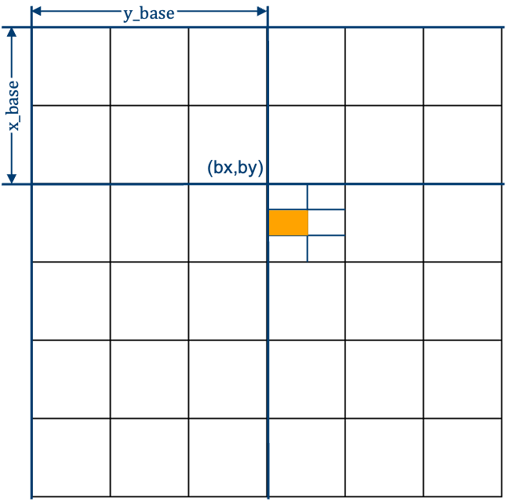

# `block` Customization Point Design

<!-- vscode-markdown-toc -->
* [Motivation](#Motivation)
* [Construction](#Construction)
	* [BCSR Construction](#BCSRConstruction)
	* [BCSR View](#BCSRView)
	* [Application: SpMV](#Application:SpMV)
	* [Application: SpMM](#Application:SpMM)

<!-- vscode-markdown-toc-config
	numbering=false
	autoSave=true
	/vscode-markdown-toc-config -->
<!-- /vscode-markdown-toc -->

## <a name='Motivation'></a>Motivation

Existing customization points include `row`, `column` and `diagonal`. Besides these, block view is known as a common view for parallelism. Therefore, `block` view is adopted as a new cp.

## <a name='Construction'></a>Construction
Here we implement BCSR format as a representative blocked sparse format and  each block is a `dense_matrix_view`. 

**BCSR**(Blocked Compressed Sparse Row) format is thought to be able to achieve resonable performance improvements compared to CSR with proper block size selected. Every block of BCSR is treated as a dense block, which may require padding with zeros. 

### <a name='BCSRConstruction'></a>BCSR Construction

It's recommended to use provided `mc::generate_bcsr` function to directly generate random benchmark by providing the following 5 arguments:
+ `m` and `n` describe the shape of matrix;
+ `block_height` and `block_width` describe the shape of block;
+ `nnz` specifies the number of non-zeros in sparse matrix;

```c++
auto [values, rowptr, colind, shape, a_nnz] =
    mc::generate_bcsr(m, n, block_height, block_width, nnz);
```

### <a name='BCSRView'></a>BCSR View

There are two ways to view generated BCSR matrix. First way is to use `bcsr_matrix_view`.

```c++
auto [values, rowptr, colind, shape, block_height, block_width, a_nnz] =
    mc::generate_bcsr(m, n, block_height, block_width, nnz);

mc::bcsr_matrix_view view(values, rowptr, colind,
                          shape, block_height, block_width, nnz);
```

The following 7 arguments are required to construct a BCSR view.
+ `values` is the array contains the entries of blocks from original matrix;
+ `rowptr` is the array contains the starting point of each row in block's view in `values` array;
+ `colind` is the array contains the column index of each block in block's view;
+ `shape` is the size of the original matrix;
+ `block_height` is the first dimension of block;
+ `block_width` is the second dimension of block;
+ `nnz` is the number of non-zero elements in original matrix.

In fact, `shape` and `nnz` can be deduced by other arguments. Currently, we choose to keep this redundancy.

For example, for matrix $A$ as follow:

$$
A = \left(
\begin{matrix}
0 & 2.42  & 0 & 0 & 0 & 0 \\
59.26 & 0 & 0 & 0 & 0 & 0 \\
0 & 0 & 0 & 0 & 0 & 0 \\
85.34 & 91.42 & 82.82 & 0 & 0 & 0\\
0 & 0 & 0 & 0 & 0 & 0\\
0 & 0 & 0 & 0 & 0 & 0\\
\end{matrix}
\right)
$$

Its `values`, `rowptr` and `colind` arrays are as follows:
```
values: [0, 2.42, 59.26, 0, 0, 0, 85.34, 91.42, 0, 0, 82.82, 0]
rowptr: [0, 1, 3, 3]
colind: [0, 0, 1]
```

Another way is to use `std::mdspan` to construct views for BCSR format. Compared with `bcsr_matrix_view` way, we only pass necessary argument here. Since conversion is user-invisible, it has more user-friendly interface `mc::blocks()`.

## Design
In this section, we introduce the design idea for SpMV and SpMM through the interfaces we designed. After that, we provide details of our interfaces.

### <a name='Application:SpMV'></a>Application: SpMV

**Sparse matrix-vector multiplication (SpMV)** of the form $y = Ax$ is a widely used computational kernel existing in many scientific applications. The input matrix $A$ is sparse. The input vector $x$ and the output vector $y$ are dense.



The following is a **dynamic** load balancing version of SpMV. The following points need to be noted:
+ `Sch` represents the strategy for parallelizing;
+ Each work item is required to fetch a task from the queue. A task is to finish a multiplication between block and sub-vector.
+ Since multiple threads can request block from `balanced_blocks`, it's necessary to set the read of `balanced_blocks` as **atomic operation**.
+ `dynamic_load_balancer` is expected to use the number of tasks `a_blocks`, the total number of work groups `num_groups` and the parallel strategy to generate work balanced queue;
+ Since the position of block cannot be determined before execution with dynamic load balancer `dynamic_load_balancer`. Therefore, the position is packed with block value in the following example, which is embodied as `x_base` and `y_base`.
+ Block and vector `b` and `c` are all stored in global memory. Memory moves are not considered in this example.

```c++
template <block_iterable A, random_access_range B, 
          random_access_range C, typename Sch>
void multiply(A&& a, B&& b, C&& c, Sch&& S) {
 
  auto num_groups = 5;
  auto r = ndrange{num_groups, 512};
  auto a_blocks = a.blocks();

  auto balanced_blocks = dynamic_load_balancer(a_blocks, num_groups, S);
 
  q.parallel_for(r, [=](auto id) {
    auto group_id = id.get_group().get_id();
    auto thread_id = id.get_local_id(0);
    
    atomic_ref<...> atomic_data(balanced_blocks);
    auto&& blockZip = balanced_blocks.pop();
    if (blockZip) {
      auto x_base = blockZip.base()[0];
      auto y_base = blockZip.base()[1];
      auto block = blockZip.value();
      for (std::size_t i = 0; i < block.shape()[0]; i ++) {
        for (std::size_t j = 0; j < block.shape()[1]; j ++) {
          auto x_addr = x_base + i;
          auto y_addr = y_base + j;
          c[x_addr] += block[{i, j}] * b[y_addr];
        }
      }
    }
  }).wait();
}
```

The following version is a **static** load balancing version of SpMV. Note the following points:
+ In the original idea, each work group is assigned a row of blocks. Each work item in group is assigned a block. Whether there is a task assgined to the work item is determined by its index;
+ Like dynamic version, we need to compute the offset of the block. 
+ Block and vector `b` and `c` are all stored in global memory.

```c++
template <block_iterable A, random_access_range B, 
          random_access_range C, typename Sch>
void multiply(A&& a, B&& b, C&& c, Sch&& S) {
 
  auto num_groups = 5;
  auto r = ndrange{num_groups, 512};
  auto a_blocks = a.blocks();

  auto balanced_blocks = static_load_balancer(a_blocks, num_groups, S);
 
  q.parallel_for(r, [=](auto id) {
    auto group_id = id.get_group().get_id();
    auto thread_id = id.get_local_id(0);
    
    if (group_id < balanced_blocks.size()) {
      auto blocks = balanced_blocks[group_id];
      if (thread_id < blocks.size()) {

        auto blockZip = blocks[thread_id];
        auto x_base = blockZip.base()[0];
        auto y_base = blockZip.base()[1];
        auto block = blockZip.value();
        
        // Treat block as dense_matrix_view
        for (std::size_t i = 0; i < block.shape()[0]; i ++) {
          for (std::size_t j = 0; j < block.shape()[1]; j ++) {
            auto x_addr = x_base + i;
            auto y_addr = y_base + j;
            c[x_addr] += block[{i, j}] * b[y_addr];
          }
        }
      }
    }
  }).wait();
}
```

### <a name='Application:SpMM'></a>Application: SpMM

**Sparse matrix-matrix multiplication (SpMM, or SpGEMM)** is a computational primitive that is widely used in areas ranging from traditional numerical applications to recent big data analysis and machine learning.


In the following example, each group is assigned a block like the blue block on the left side of the above figure. Each work item is required to finish multiplication between the specified block and a tile, which is like the red vector on the right side of the above figure. 

```c++
template <block_iterable A, dense_matrix_view B, 
          dense_matrix_view C, typename Sch>
void multiply(A&& a, B&& b, C&& c, Sch&& S) {
  auto M = 32;
  auto N = 32;
  auto r = ndrange{{M, N}, 512};
  auto a_blocks = a.blocks();

  auto balanced_blocks = static_load_balancer(a_blocks, {M, N}, S);
 
  q.parallel_for(r, [=](auto id) {
    auto idx = id.get_global_id()[0];
    auto idy = id.get_global_id()[1];
    auto thread_id = id.get_local_id(0);
    
    if (m < balanced_blocks.shape()[0] && n < balanced_blocks.shape()[1]) {
      auto blockZip = balanced_blocks[{idx, idy}];

      // If thread_id is less than the width of B,
      // it can be assigned a matrix-vector multiplication task.
      if (thread_id < B.shape()[1]) {
        auto blockZip = blocks[thread_id];
        auto x_base = blockZip.base()[0];
        auto y_base = blockZip.base()[1];
        auto block = blockZip.value();

        for (std::size_t i = 0; i < bm; i ++) {
          for (std::size_t j = 0; j < bn; j ++) {
            auto x_addr = x_base + i;
            auto y_addr = y_base + j;

            // Use the access features of dense_matrix_view
            c[{x_addr, thread_id}] += block[{i, j}] * b[{y_addr, thread_id}];
          }
        }
      }
    }
  }).wait();
}
```

### Interface design

```c++
template <typename WorkItem>
class work_balanced_iterator {
  auto *operator() {
    return q_->pop();
  }
private:
  std::shared_ptr<queue<WorkItem>> q_;
};
 
template <typename WorkItem>
class work_balanced_range {
public:
  auto begin() {
    return iterator();
  }
  auto end() {
    sentinel();
  }
private:
  std::shared_ptr<atomic_queue<WorkItem>> q_;
};
```